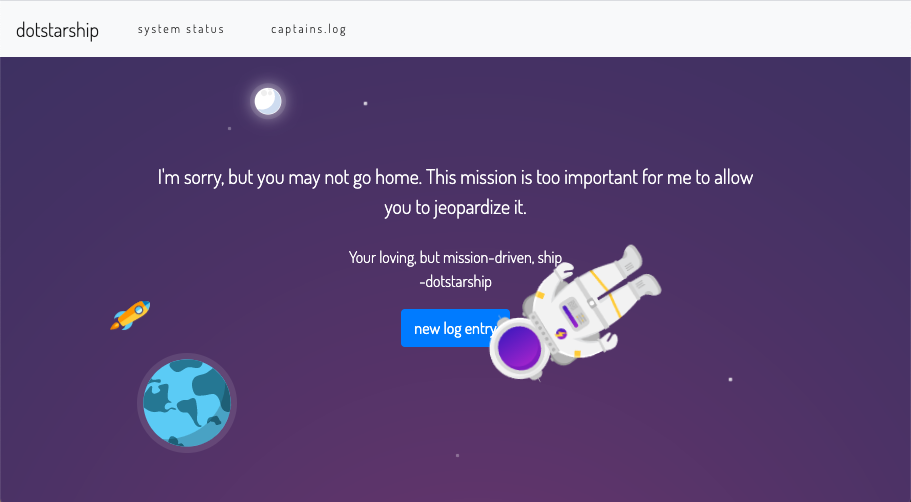

# The Great Escape by Samy Kamkar and Matt Austin

As an intrepid interplanetary hacker extraordinaire you often find yourself in risky situations.  However, this morning as you blink your eyes awake and take in your surroundings, you find yourself unsure how you ended up in a foreign spacecraft on what appears to be a desolate planet devoid of civilization.

Your crew, made up of some of the greatest hackers in the universe, also begins to stir.  You appear to be stranded on this forsaken planet in this malfunctioning ship.  The only system that appears to be online is the captain’s log, while flight and navigational systems are down.  Your mission is to bring the flight and navigational systems back online in order to get home!



## To run
```
docker-compose up
```

Browse to [http://localhost:5000](http://localhost:5000)

